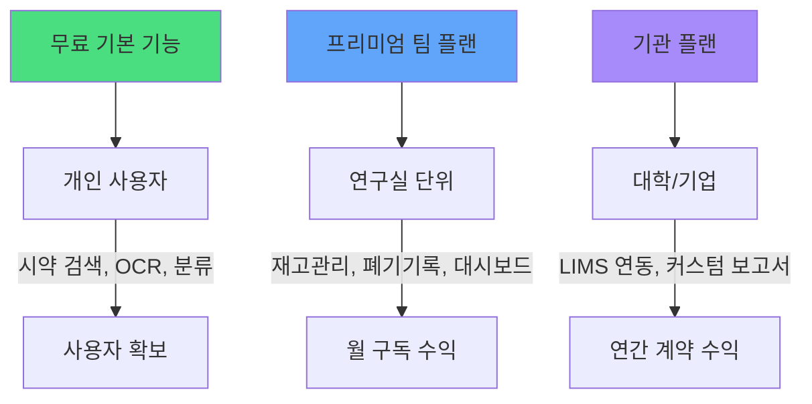

# Buril-Lab 고도화 로드맵 & 비즈니스 모델 제안

## 현재 앱 현황 요약

| 영역 | 구현 상태 |
|------|----------|
| 시약 검색 (PubChem + KOSHA) | ✅ 완료 |
| OCR 카메라 스캔 (PaddleOCR) | ✅ 완료 |
| 폐기 분류 엔진 (유기/무기/할로겐/산/알칼리) | ✅ 완료 |
| GHS 위험물 표시 | ✅ 완료 |
| MSDS 뷰어 | ✅ 완료 |
| 혼합폐액 분석 | ✅ 완료 |
| 제품 카탈로그 (Supabase) | ✅ 완료 |
| 다국어 (한/영) | ✅ 완료 |
| 최근 검색 기록 | ✅ 완료 |

---

## Phase 1: 핵심 사용자 기능 강화 (실험실 필수 기능)

### 1.1 📋 폐액 처리 기록 & 로그 관리
> 실험실 안전 감사 시 **가장 자주 요구되는 데이터**

- **폐기 기록 저장**: 날짜, 시약명, 양(mL/L), 폐기통 분류, 처리자
- **PDF/Excel 내보내기**: 감사 보고서 자동 생성
- **월별/분기별 통계 대시보드**: 폐액 종류별 사용량 시각화

```
[연계 방법]
- Supabase `waste_logs` 테이블 생성
- 기존 CartView에 "폐기 완료" 버튼 추가 → 기록 자동 저장
- 새로운 "기록" 탭 추가 → 이력 조회 + 통계 차트
```

### 1.2 🧪 시약 재고 관리 (Inventory)
> 연구실에서 보유 중인 시약 현황 파악

- **시약 목록 등록**: 검색 결과에서 바로 "보유 시약 등록"
- **바코드/QR 스캔**: 시약병 바코드 인식 → 자동 등록
- **유효기한 알림**: 유통기한 임박 시약 푸시 알림
- **위치 관리**: 보관 위치(냉장, 시약장 번호 등)

```
[연계 방법]
- Supabase `inventory` 테이블 (시약ID, 수량, 위치, 유효기한, 등록일)
- 기존 ResultCard에 "재고로 등록" 버튼 추가
- Scanner 컴포넌트 확장: 바코드 모드 추가
```

### 1.3 ⚠️ 호환성(Compatibility) 경고 시스템
> 같은 보관함/폐액통에 넣으면 안 되는 시약 자동 감지

- **보관 호환성 매트릭스**: 산화제+환원제, 산+유기물 등 위험 조합 경고
- **혼합 시 실시간 경고**: CartView에 시약 추가 시 즉시 "⚠️ 위험한 조합!" 표시
- **SDS Section 10 자동 분석**: 반응성 데이터 활용

```
[연계 방법]
- chemicalAnalyzer.ts 확장: 호환성 규칙 엔진 추가
- mixtureLogic.ts에 호환성 체크 로직 통합
- GHS H-code 기반 자동 분류 (H270 산화제, H250 자연발화 등)
```

### 1.4 📱 PWA & 오프라인 지원
> 인터넷이 불안정한 실험실 환경 대응

- **Service Worker**: 앱 오프라인 사용 가능
- **자주 검색하는 시약 캐싱**: IndexedDB에 PubChem 데이터 저장
- **홈 화면 추가(A2HS)**: 네이티브 앱처럼 설치

---

## Phase 2: 팀/기관 기능 (비즈니스 모델 기반)

### 2.1 👥 멀티유저 & 팀 관리

| 기능 | 설명 |
|------|------|
| **Supabase Auth** | 이메일/소셜 로그인 |
| **팀(Lab) 생성** | 연구실 단위 그룹 |
| **역할 분리** | 지도교수 / 관리자 / 연구원 / 학생 |
| **공유 재고** | 팀원 간 시약 재고 공유 |
| **활동 로그** | 누가 언제 무엇을 폐기했는지 |

### 2.2 📊 안전 관리자 대시보드 (Admin)
> 실험실 안전관리자에게 가장 큰 가치를 제공

- **실험실별 폐액 현황** 종합 뷰
- **위험물 보유 현황**: GHS 위험등급별 시약 통계
- **규정 준수 체크리스트**: 실험실 안전 점검표 자동 연동
- **알림 시스템**: 유효기한 만료, 재고 초과, 미처리 폐액 경고

### 2.3 🏫 기관 연동 (University/Institute Integration)
- **안전관리 시스템(LIMS) 연동**: 대학 안전관리실 데이터 포맷 내보내기
- **화학물질안전원(NICS) 보고서 양식**: 화학물질 취급 보고서 자동 생성
- **교육이수 기록 연동**: 실험실 안전교육 이수 여부 확인

---

## Phase 3: 비즈니스 모델 제안

### 💰 수익화 전략



| 플랜 | 가격 | 포함 기능 |
|------|------|----------|
| **Free** | ₩0 | 시약 검색, OCR 스캔, 폐기 분류, GHS 정보 |
| **Lab Pro** | ₩15,000/월/실험실 | 재고 관리, 폐기 기록/통계, 호환성 경고, 5명까지 |
| **Institute** | 별도 협의 | 무제한 인원, LIMS 연동, 커스텀 보고서, SLA |

### 🎯 타겟 시장 진입 전략

1. **1단계 (지금)**: 무료 앱으로 대학원생/연구원 사용자 확보
2. **2단계 (3개월 후)**: 폐기 기록 + 재고 관리 → Lab Pro 출시
3. **3단계 (6개월 후)**: 대학 안전관리실 파일럿 → Institute 플랜 시작

---

## Phase 4: 기술 부채 해소 & 품질 강화

### 4.1 🧪 테스트 & CI/CD
- **Unit Test** 추가: `chemicalAnalyzer`, `mixtureLogic`, `wasteDisposal` (Vitest)
- **E2E Test**: Playwright로 핵심 플로우 자동화 (검색 → 분류 → 혼합)
- **GitHub Actions**: PR마다 자동 빌드/테스트/린트

### 4.2 🏗️ 아키텍처 개선
- **React Router** 도입: 현재 단일 페이지 → 다중 페이지 (검색/재고/기록/설정)
- **Error Boundary** 추가: API 실패 시 graceful fallback
- **코드 분할**: 라우트 기반 lazy loading으로 초기 로딩 속도 개선

### 4.3 📈 분석 & 모니터링
- **Sentry**: 에러 트래킹 (프로덕션 버그 감지)
- **Analytics**: 어떤 시약이 가장 많이 검색되는지 데이터 수집
- **OCR 정확도 추적**: 스캔 성공/실패율 모니터링

---

## 즉시 시작 가능한 우선순위 추천

> [!IMPORTANT]
> 아래 순서로 진행하면 **최소 노력으로 최대 가치**를 달성할 수 있습니다.

| 순위 | 작업 | 예상 소요 | 사용자 임팩트 |
|------|------|----------|------------|
| 🥇 1 | PWA 오프라인 지원 | 1-2일 | ⭐⭐⭐⭐⭐ |
| 🥈 2 | 폐기 기록 로그 기능 | 3-5일 | ⭐⭐⭐⭐⭐ |
| 🥉 3 | 호환성 경고 시스템 | 2-3일 | ⭐⭐⭐⭐ |
| 4 | 테스트 코드 작성 | 2-3일 | ⭐⭐⭐ |
| 5 | React Router 도입 | 1-2일 | ⭐⭐⭐ |
| 6 | Supabase Auth + 팀 관리 | 5-7일 | ⭐⭐⭐⭐ |
| 7 | 재고 관리 시스템 | 5-7일 | ⭐⭐⭐⭐⭐ |

---

어떤 Phase나 기능부터 시작하고 싶으신지 알려주시면, 해당 기능에 대한 **상세 구현 계획서**를 작성하겠습니다.
